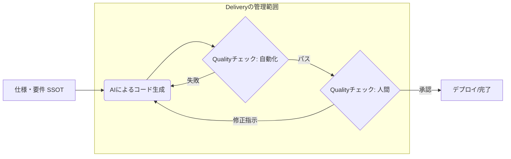

# spec駆動開発における Quality と Delivery のチェックポイント

「要件一覧」「機能一覧」が仕上がった後、プロジェクトメンバーの作業等の変化をまとめます。

## 開発環境の導入

### 変化しないところ

- 案件に合わせた開発環境を構築します

### spec駆動開発時に変化するところ

- CLAUDE.md(標準)をプロジェクトに合わせて書き換えます。Gitのrootディレクトリに配置します。
- agents / skills などをコピーします。

## PMやリーダーが受ける影響

spec駆動開発を導入しても、プロジェクト管理の方法は変化しません。
従来通りBacklog等のタスクのWBSの状況がそのままの進捗状況となります。

## エンジニアが受ける影響

タスクの区切り方、タスクの記載事項、タスクの運用（ワークフロー）、終了条件が変化します。

### タスクの区切り方

### タスクの記載事項

### ワークフロー
spec駆動開発における実装の Quality と Delivery を管理するための、標準的なチェックフローです。
これを **ユーザーストーリー** 、 **フィーチャー** の単位で実施します。

### 終了条件