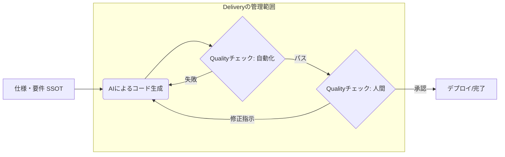

# spec駆動開発における Quality と Delivery のチェックポイント

「要件一覧」「機能一覧」が仕上がった後、プロジェクトメンバーの作業等の変化をまとめます。

## 開発環境の導入

### 変化しないところ

- 案件に合わせた開発環境を構築します

### spec駆動開発時に変化するところ

- CLAUDE.md(標準)をプロジェクトに合わせて書き換えます。Gitのrootディレクトリに配置します。
- agents / skills などをspec駆動開発に対応したAIエージェント情報をコピーします。

## PMやリーダーが受ける影響

spec駆動開発を導入しても、プロジェクト管理の方法は変化しません。
従来通りBacklog等のタスクのWBSの状況がそのままの進捗状況となります。

## エンジニアが受ける影響

タスクの区切り方、タスクの記載事項、タスクの運用（ワークフロー）、終了条件が変化します。

### タスクの区切り方

子タスクの作り方は以下の通りになる。

- データモデルの設計(DTO、DBスキーマ設計)
- 画面設計(フロントエンド設計)
- API、DTOとバリデーションバリデーション設計
- DTOとバリデーションバリデーション実装
- API実装
- 画面実装

#### データモデルの設計(DTO、DBスキーマ設計)

> **エンジニアとAIが対話してデータ構造を決定する**タスクです。
> 同じデータを扱う複数の画面があるはずです。関連する画面の最初の1つを作るときに、データモデルの設計を行います。
> 以降の工程をAI自動化するために必要な手順です。

- 入力
  - データの名称(例えばCustomer、Employee)
  - 保持すべき情報群
    - 各フィールドの上限値・下限値、最大長、NULL許容などを定める（これらは後にUnitTestを作るために必要）
  - 削除のパターンについては明確にしておく
    - 論理削除型 or 物理削除型
  - 既存テーブルとのリレーション
    - カスケード削除の有無を考える
- 終了条件
  - DBのスキーマを決定(schema.prismaなど)
  - DTOとバリデーションの決定(Zod、schema.graphqlなど)

#### 画面設計(フロントエンド設計)

##### 一覧画面の場合

##### 詳細表示

##### 生成・更新画面の場合

- 

#### DBのスキーマを作る

#### DTOとValidationを作る

### タスクの記載事項

### ワークフロー
spec駆動開発における実装の Quality と Delivery を管理するための、標準的なチェックフローです。
これを **ユーザーストーリー** 、 **フィーチャー** の単位で実施します。

### 終了条件