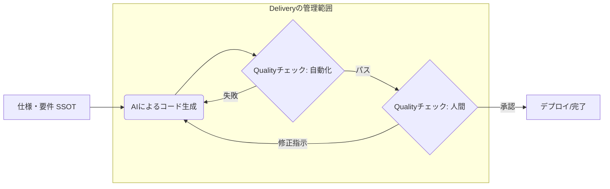

# Quality（品質）とDelivery（納期/速度）のチェックポイント

従来型の開発と異なり、spec駆動開発では「AIが書いたコードの正当性」をいかに効率的に検証し、開発サイクルをいかに円滑化させるかが重要です。

## 1. spec駆動開発ワークフロー
spec駆動開発における実装の Quality と Delivery を管理するための、標準的なチェックフローです。
これを **ユーザーストーリー** 、 **フィーチャー** の単位で実施します。

---

## 2. Quality のチェックポイント

品質管理は「仕様との整合性」と「自動化された防壁」の二段構えで確認します。

| カテゴリ | チェックポイント | 内容・基準 |
| :--- | :--- | :--- | :--- |
| **仕様整合性** | **SSOT/Storyとの一致** | コードが、ソースオブトゥルース（実装基準）、仕様・要件定義ファイルの内容を正確に反映しているか。 |
| **静的品質** | **AI Linter/Security** | セキュリティ脆弱性やアンチパターンが含まれていないか。特にシークレットのハードコードや、SQLインジェクションの有無。 |
| **動的品質** | **テストカバー率の維持** | AIにテストコードを生成させた際、エッジケース（境界値、異常系）が網羅されているか。 |
| **一貫性** | **プロジェクト規約の遵守** | 既存のディレクトリ構造、命名規則、アーキテクチャ（クリーンアーキテクチャ等）を逸脱していないか。 |

---

## 3. Delivery のチェックポイント

spec駆動開発における「納期」は、単なる終了日ではなく、 **「開発サイクル（イテレーション）の速度」** として捉えます。 
下記の状態が生じている場合、AIに与えているspecの精度が悪い可能性が高い。

| カテゴリ | チェックポイント | 内容・基準 |
| :--- | :--- | :--- |
| **生成効率** | **プロンプト・リトライ数** | 1つのタスクに対し、AIへの再指示が3回以上発生していないか。発生している場合は **仕様の分割が不十分**。 |
| **レビュー負荷** | **PRサイズと可読性** | AIが一気に生成した大量のコードが、人間が15分以内にレビューできる量に収まっているか。 |
| **サイクルタイム** | **プロンプト〜マージまでの時間** | 仕様決定からマージまでのリードタイム。AI導入前と比較して、ボトルネック（主にレビュー待ち）が発生していないか。 |
| **技術負債** | **コードの削除率** | 後続のタスクで、AIが生成したコードをどれだけ「書き直し」たか。無駄な生成は将来の納期を圧迫する。 |

早期発見と改善を行うことで、開発後半に急激にデリバリーが劣化することを防止する。

---

## 4. 効果的な運用のための「仕組み」

- **「Spec as a Single Source of Truth」の徹底:** 常に **「仕様書を最新の状態に保ち、それをAIに読み込ませる」** というプロセスをチェックポイントの最優先事項に据えます。
- **レビューの「逆転」発想:** 人間がコードを一行ずつ読むのではなく、 **「AIにテストコードを書かせ、そのテストが仕様を満たしているかを人間が確認する」** というプロセスへ切り替えます。
- **Developer Experienceの視点:** 「このコードを自分で説明できるか？」「自分が実装したらこのような作りにするか？」というエンジニアの主観的なチェックポイントを設けることは必要です。

## 5. まとめ

spec駆動開発を導入することで、 Delivery は劇的に向上しますが、それを Quality の低下に繋げないために、防衛的な開発体制が必要となります。 
Quality が低下すると連動して Delivery も不安定になります。 Delivery のチェックポイントに列挙した兆候を人間が監視します。
