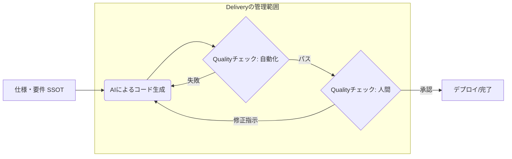

# Quality（品質）とDelivery（納期/速度）のチェックポイント

従来の開発と異なり、spec駆動開発では「AIが書いたコードの正当性」をいかに効率的に検証し、開発サイクルを円滑化させるかが重要です。
- ユーザーストーリーの粒度が荒いAIのリトライ回数が増え、結果としてトークンの浪費・実装の停滞を招きます

---

## 1. Quality のチェックポイント
AIは「もっともらしい嘘」や「コンテキストの欠落」を平気で行います。品質管理は「仕様との整合性」と「自動化された防壁」の二段構えで設定します。

| カテゴリ | チェックポイント | 内容・基準 |
| :--- | :--- | :--- |
| **仕様整合性** | **SSOTとの一致** | コードが、ソースオブトゥルース（仕様書や要件定義ファイル）の内容を正確に反映しているか。 |
| **静的品質** | **AI Linter/Security** | セキュリティ脆弱性やアンチパターンが含まれていないか。特にシークレットのハードコードや、SQLインジェクションの有無。 |
| **動的品質** | **テストカバー率の維持** | AIにテストコードを生成させた際、エッジケース（境界値、異常系）が網羅されているか。 |
| **一貫性** | **プロジェクト規約の遵守** | 既存のディレクトリ構造、命名規則、アーキテクチャ（クリーンアーキテクチャ等）を逸脱していないか。 |

---

## 2. Delivery のチェックポイント

spec駆動開発における「納期」は、単なる終了日ではなく、 **「開発サイクル（イテレーション）の速度」** として捉えます。

| カテゴリ | チェックポイント | 内容・基準 |
| :--- | :--- | :--- |
| **生成効率** | **プロンプト・リトライ数** | 1つのタスクに対し、AIへの再指示が3回以上発生していないか。多すぎる場合は **仕様の分割が不十分**。 |
| **レビュー負荷** | **PRサイズと可読性** | AIが一気に生成した大量のコードが、人間が15分以内にレビューできる量に収まっているか。 |
| **サイクルタイム** | **プロンプト〜マージまでの時間** | 仕様決定からマージまでのリードタイム。AI導入前と比較して、ボトルネック（主にレビュー待ち）が発生していないか。 |
| **技術負債** | **コードの削除率** | 後続のタスクで、AIが生成したコードをどれだけ「書き直し」たか。無駄な生成は将来の納期を圧迫する。 |

---

## 3. spec駆動開発ワークフローの視覚化
spec駆動開発における Quality と Delivery を管理するための、標準的なチェックフローです。

---

## 4. 効果的な運用のための「仕組み」

### 「Spec as a Single Source of Truth」の徹底
AIへの指示を口頭や曖昧なメモで行うと、 Quality も Delivery も著しく低下します。常に **「仕様書を最新の状態に保ち、それをAIに読み込ませる」** というプロセスをチェックポイントの最優先事項に据えてください。仕様がコードと乖離した瞬間、AIは負債を量産するマシーンに変わります。

### レビューの「逆転」発想
人間がコードを一行ずつ読むのではなく、 **「AIにテストコードを書かせ、そのテストが仕様を満たしているかを人間が確認する」** というプロセスへの切り替えが、 Quality を維持しつつ Delivery を加速させるポイントです。

### ワイルドカード：DX（Developer Experience）の視点
QCDに加えて、 **「開発者の納得感」** も重要です。AIが生成したコードを理解せずにマージし続けると、保守フェーズで Quality も Delivery も崩壊します。「このコードを自分で説明できるか？」という主観的なチェックポイントを設けることをお勧めします。

AIDDを導入することで、特に「D」は劇的に向上しますが、それを「Q」の低下に繋げないためのゲートウェイを、パイプラインの各所に配置してみてください。